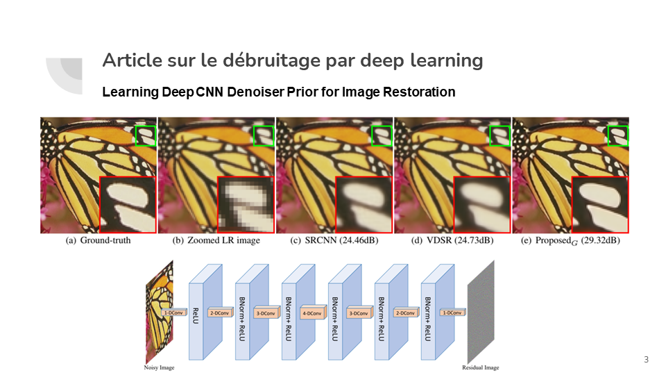
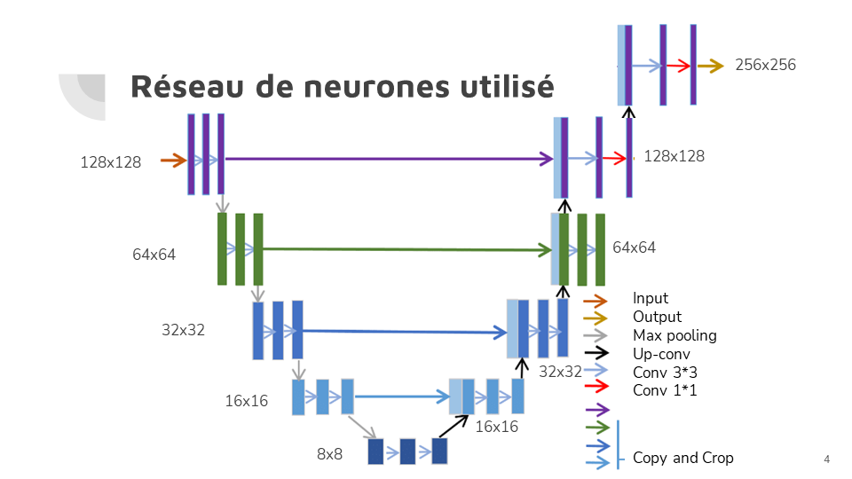
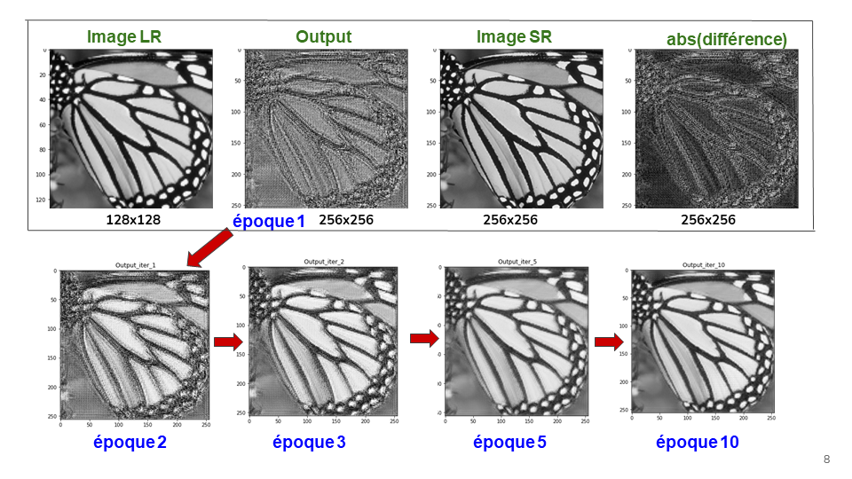
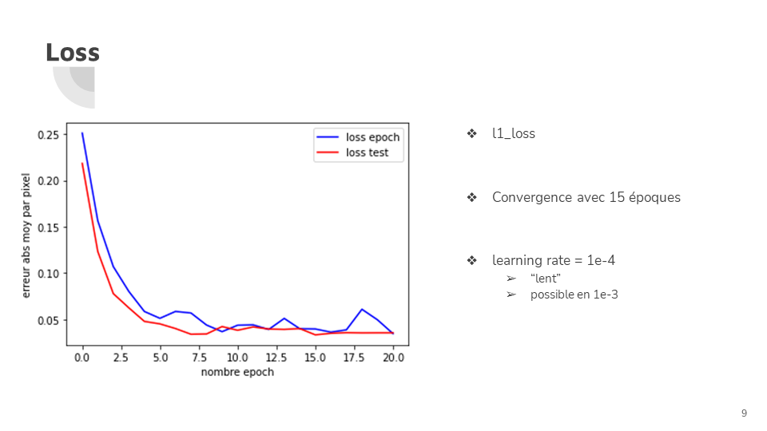
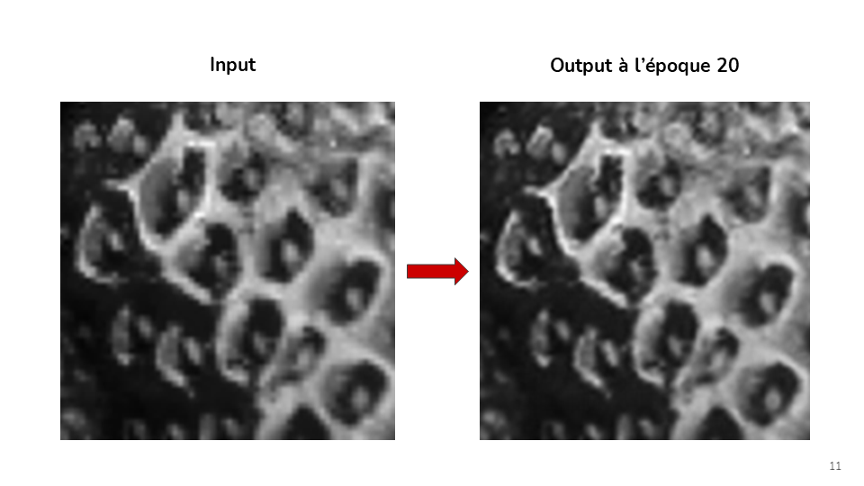
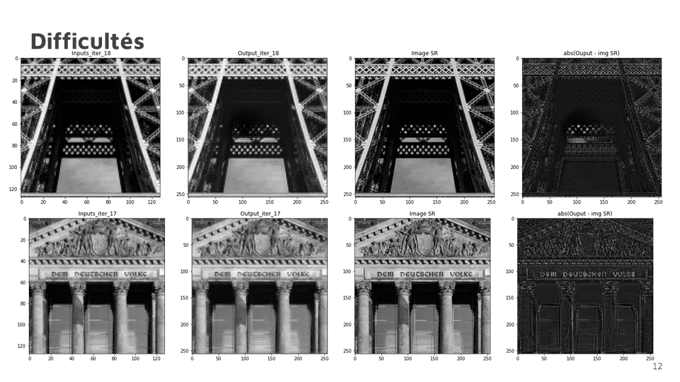

# Zoom Super Resolution

## Neural Network for Super Resolution

Upsacle by a factor 2 an under-determined 256x256 crop of an image and improve the output resolution of the same scene to a 512x512 image through a 5-layer neuronal network.

## Neural Network built : Unet structure 

5 layers, 4 for convolution and downsizing and the final one to upscale the image.

## Reconstruction throughout the epochs

## Trainset and Testset error 

## Good Results 

## Difficulties 

