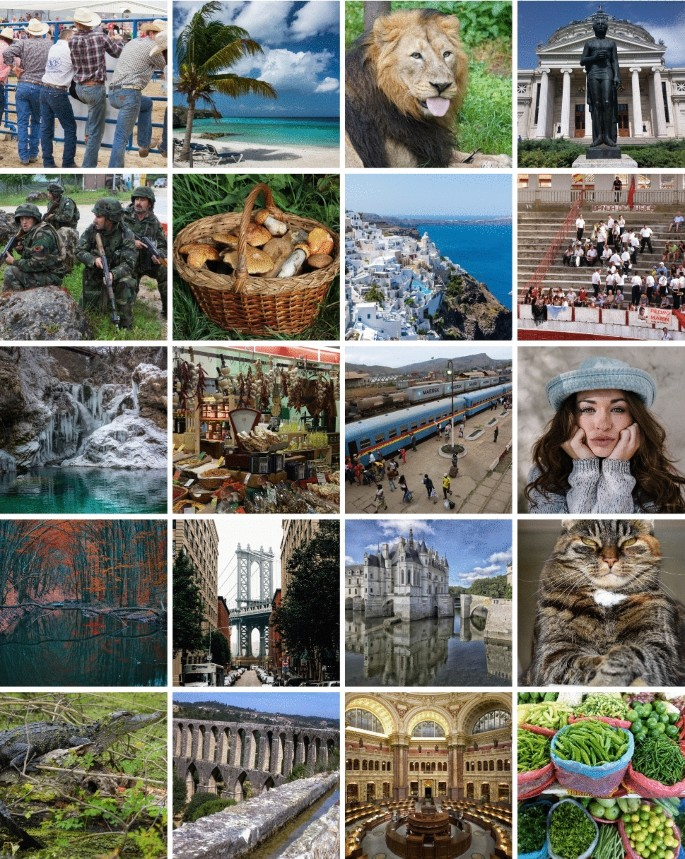

# Zoom Super Resolution

  The aim of this project is to enhance the resolution of zoomed area in a image. Inspired by the article entitled "Learning Deep CNN Denoiser Prior for Image Restoration" by Kai Zhang, I have used a CNN (convolutionnal neural network) with a similar structure.  
The dataset is composed of 900 images from the DIV2K dataset, split into 800 images for the train set and 100 for the test set.

  

## Comparison method of the digital zoom improvements 

Upscale by a factor 2 an under-determined 256x256 scene and improve the output resolution of the same scene to a 512x512 image through a 5-layer CNN.

Description step-by-step process of resolution augmentation :  
(a) in a super resolved image, a 512x512 snapshot will be consiedered as the ground truth  
(b) in a under resolved image, a 256x256 snapshot of the same area is the image that will be improved  
(c) result of a SRCNN improvement  
(d) result of a VDSR improvement   
(e) result of the CNN improvement in the article  

  

## Neural Network built : Unet structure 

5 layers, 4 for convolution and downsizing and the final one to upscale the image.

## Reconstruction throughout the epochs

## Trainset and Testset error 

## Good Results 

## Difficulties 

